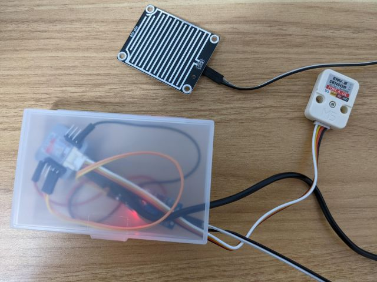
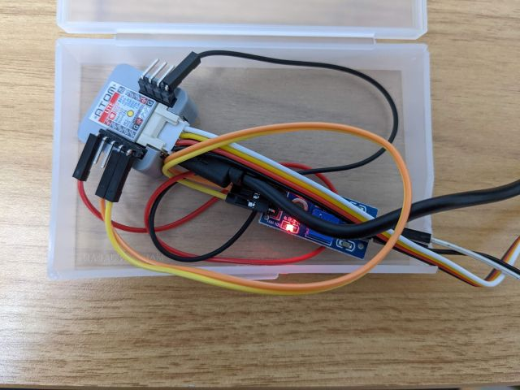

# rain-detection
雨が降ったらLINEに通知するM5Stack ATOM Lite用プログラム。




## 使用したハードウェア
- [M5Stack ATOM Lite](https://docs.m5stack.com/en/core/atom_lite)
- [雨滴センサ(買ったやつは既にamazonからなくなってたけど同じようなのはたくさんある)](https://www.amazon.co.jp/s?k=%E9%9B%A8%E6%BB%B4%E3%82%BB%E3%83%B3%E3%82%B5)
- [M5Stack ENV III (温湿度気圧センサユニット)](https://docs.m5stack.com/en/unit/envIII)
- [ダイソーのカードケース(端っこを少し切断してケーブルを通した)](https://jp.daisonet.com/collections/stationery0291/products/4906137313913)

## 使用したサービス
- [LINE Notify](https://notify-bot.line.me/)
  - https://notify-bot.line.me/my/ から、アクセストークンを発行し、後述の `src/.mysecret.h` に指定する必要がある。
- [Ambient](https://ambidata.io/)
  - https://ambidata.io/ch/channels.html から、チャネルを作成し、発行されたチャネルIDとライトキーを後述の `src/.mysecret.h` に指定する必要がある。

## 使用方法
```sh
$ git clone git@github.com:sattoke/rain-detection.git
$ cd rain-detection
$ vim src/.mysecret.h
$ pio run -t upload
```

`src/.mysecret.h` には下記内容が含まれる必要がある

```cpp
const char* SSID = "xxx";           // WiFiのSSID
const char* PASSPHRASE = "xxx";     // WiFiのパスフレーズ
const char* AMB_WRITEKEY = "xxx";   // Ambientのライトキー
const uint32_t AMB_CHANNELID = xxx; // AmbientのチャネルID
const char* LINE_TOKEN = "xxx";     // LINE Notifyのアクセストークン
```

またOTA前提になっているため、初回だけはUSBケーブルで接続して `platformio.ini` の下記の行をコメントアウトするか、有線用のenvセクションを作成する必要があるはず。

```ini
upload_protocol = espota
upload_port = m5atom.local
```
